* Using a fixed window size can cause us to dip under the optimal number of packets in-flight, especially when lost packets occur. 
    * Suppose the window size is 3. A sends packets 1, 2, and 3. 
    * Suppose packet 2 gets lost and B sends back two ACKS: {{ACK 1, and ACK 1}}.
    * A is now forced to resend {{2}} and wait for {{ACK 2}} before it can send 4 and 5. During this time period, even if the window size is 3, there's only {{one packet}} in flight. In this way, network losses cause window size to become a less accurate proxy for the number of packets in flight.
* To determine the ideal window size, TCP often sends trial packets to empirically determine at what window size the {{network loss}} rate peaks (and starts to drop off thereafter). 
    * Since the best window size is always changing due to cross-traffic, the experiment is run very frequently by hosts to ensure the optimal window size is being used.
    * Problems with this mode: 
        * the window size will react to any change in packet drops, even if they do not relate to network congestion (ex. radio interference), which not the appropriate diagnosis.
        * Also, detecting a loss requires at least one RTT (often more), which adds roughly 1.4 RTTs of extra delay per loss event. 
    * In order to avoid network overload,  
        * increase is implemented slowly, for example +1 packet per RTT. 
        * decrease is implemented instantaneously, for example juming all the way down to the minimum window size. 
* "TCP Tahoe": TCP's implementation of simple congestion control. 
    * Tracked variables: `cwnd` (congestion window), `ssthresh` (slow start threshold)
    * Modes of operation: 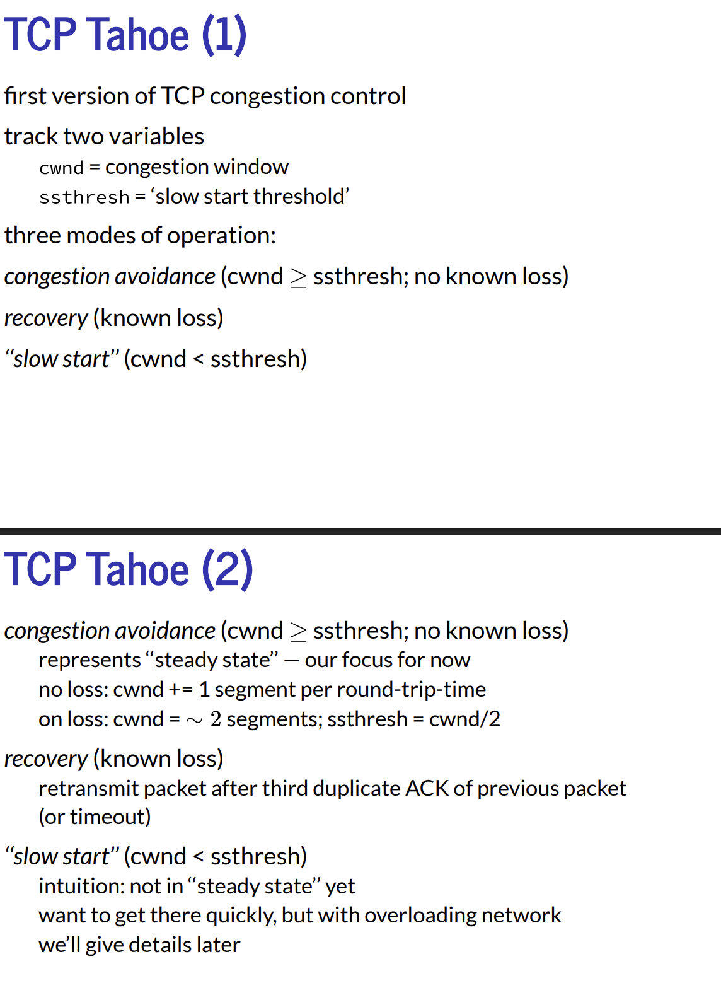
        * "Congestion avoidance": The default mode. Every RTT, `cwnd` increments by 1, and if we lose a packet, `cwnd` resets to 2 segments. ("on loss"??)
        * "Recovery": 
        * "Slow start": 
    * "TCP Reno"/"TCP New Reno": same thing as TCP Tahoe, except...
        * 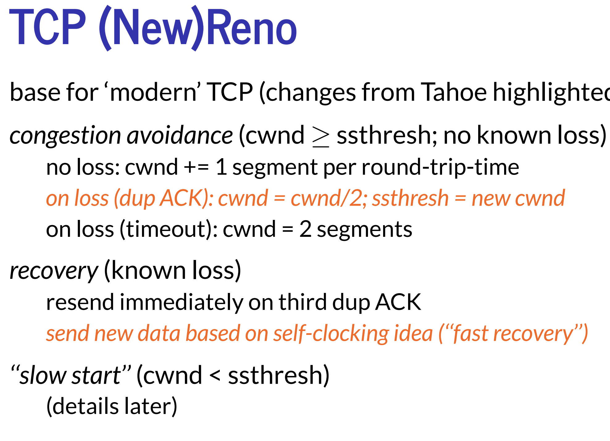
* "AIMD" (additive increase & multiplicative decrease): 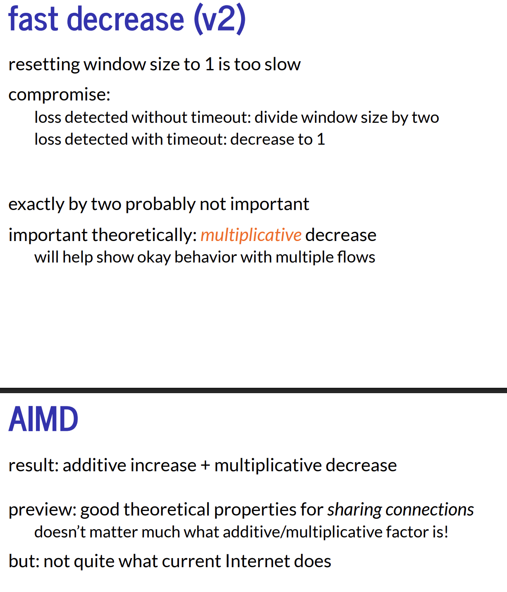
    * This is optimal because... (graph stuff)
    * This fails when...
        * differing RTTs for different hosts 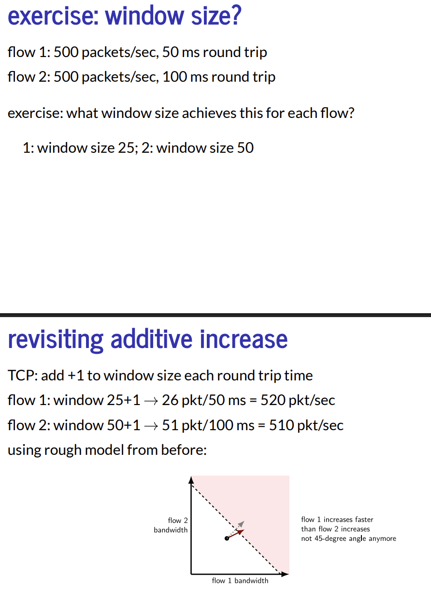
        * hosts that have more connections open 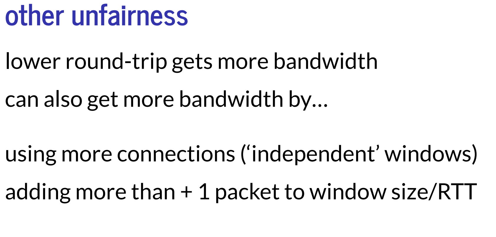
* Packet loss due to non-congestion reasons can heavily impact the achieved bandwidth. In order to minimize packet loss due to non-congestion reasons, the network model redundantly handles acknowledgements and resents across multiple layers.
* "Min-max fairness": if it is impossible to increase your achieved bandwidth without stealing from a network edge that is slower (poorer) than you, the network is fair. If it's still possible to steal from a network edge that is faster (richer) than you, then the network is unfair.
* Jain’s fairness index: 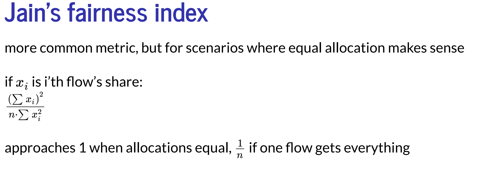
* TCP strategies of congestion control
* "TCP friendliness": 
    * "Slow start": instead of starting at a high initial window size, you start with a window size of 1 and increase the window by one packet for each ACK. Do this until your first packet loss.
    * "Fast retransmit": if you see enough duplicate ACKs, override the timeout and resend the appropriate packet early. 
    * In ideal circumstances, the window size reflects the number of packets in flight. However, when a packet is lost... 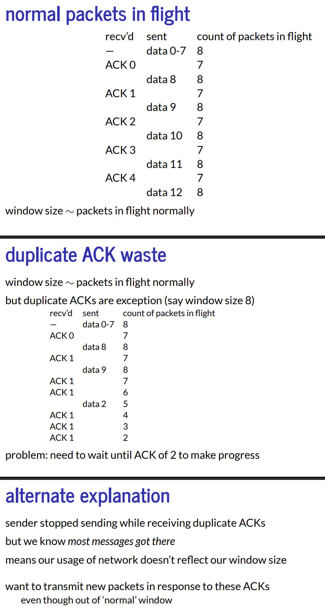. TCP solves this using a feature called "fast recovery". 
        * Fast recovery works by temporarily adding a constant value to the base window size if and only if we're currently recovering from a packet loss. This is called "inflating the effective window size". 
    * "Selective ACKs" (SACKs): 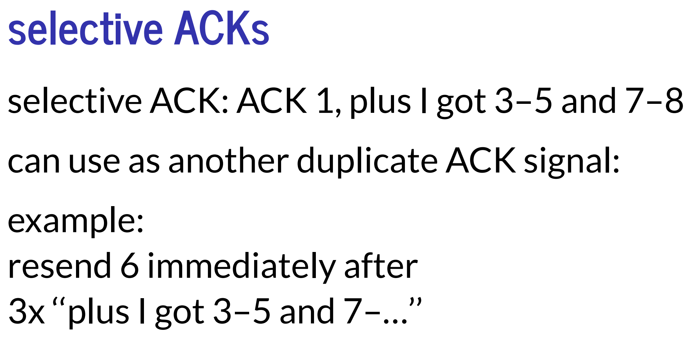
    * To prevent the problem of ACKs on the way back becoming congested, we use "delayed ACKs", where we try to send ACKs for multiple messages at a time instead for every packet.
    * RTT variance estimation: instead of setting timeouts to a constant 2*RTT, ...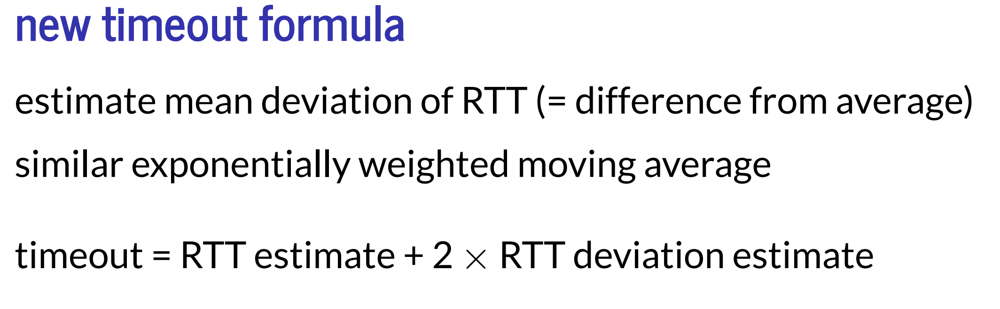
    * Exponential retransmit timer backoff: 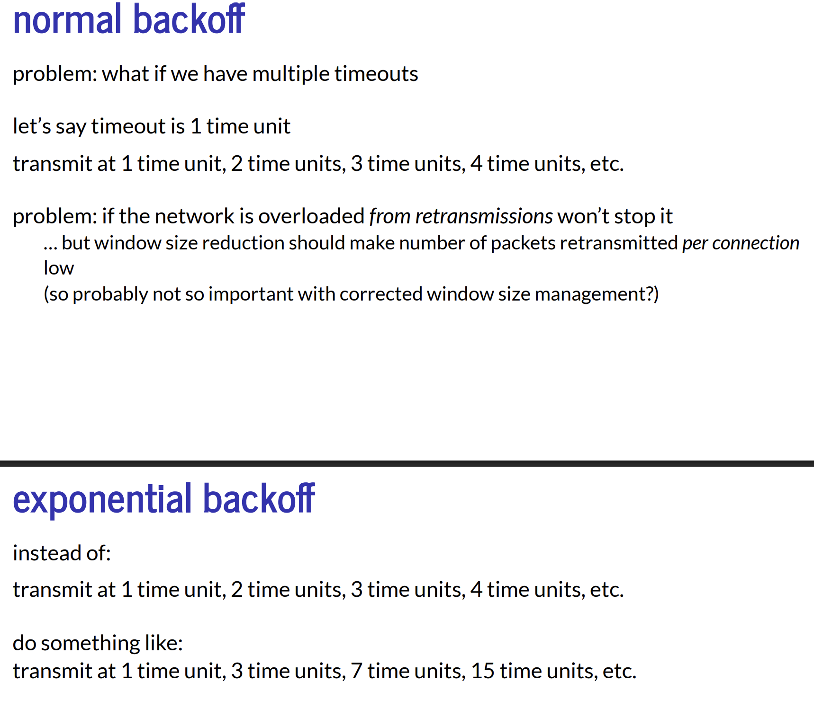
* Queuing theory: concludes that in reality, networks can never (or should never attempt to) achieve full utilization 
    * Setup: 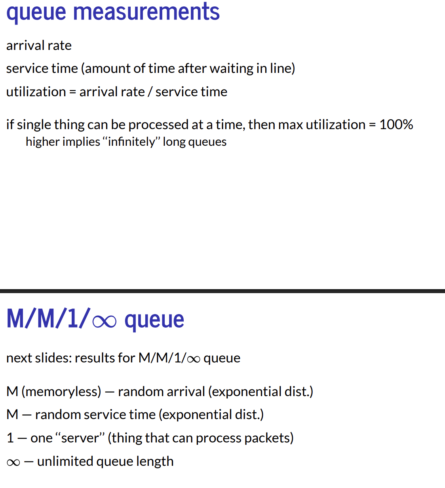
    * Result: 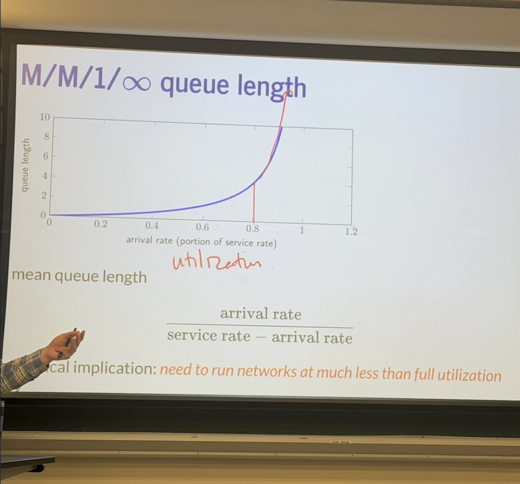

## Exercises: 
* Suppose a switch can handle 50 packets/second, there are 100 packets/second coming from a test flow sending as fast as it can, and 10 packets/second from other session. 
    * What's the expected loss rate, not accounting for resent packets due to network loss? {{60/110}}
    * Assuming packets are randomly spaced, drops hit packets at random, and the queue is large, how would the loss rate for the test flow compare to the loss rate from the other session? {{They should be about equal}} 
* Suppose we have a 50-ms RTT, we're initially sending at 600 packets/second, but we find the optimal rate is 10000 packets/second. How long in seconds does it take to optimal window size? {{23.5 seconds}}

* Consider the network above. 
    * By min-max fairness, is this fair or unfair? solid = 10MByte, dotted = 2MByte/s, dashed = 3MByte/s {{unfair}}
    * By min-max fairness, is this fair or unfair? solid = 16MByte, dashed = 2MByte/s, dashed = 2MByte/s {{unfair}}
    * By min-max fairness, what are the optimal bandwidths? {{solid = 15MByte, dashed = 2.5MByte/s, dashed = 2.5MByte/s}}
* Given 500 packets/sec and a 50 ms round trip, calculate the window size. {{25}}
* Given 500 packets/sec, 100 ms round trip, calculate the window size. {{50}}
* Suppose A sends 4 packets to B, B sends 8 packets to A in response, then A sends 1 packet to B in response. Assume that both hosts are using slow start and begin sending their responses instantaneously upon recieving the whole message from the other side. How many RTTs does this exchange take? {{6.5 RTTs}}
* Suppose the transmission delay is 1 ms, and the propagation delay is 20 ms. 
    * What does the RTT depend on? {{how many packets are in the queue}}
    * What's the minimum RTT? {{43 ms}} Max RTT? {{52 ms}}
