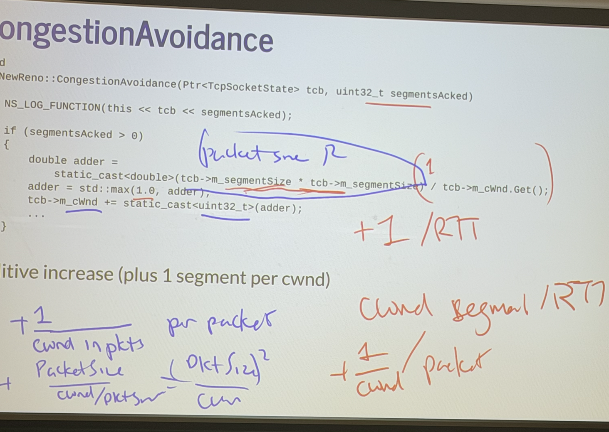

* Compare and contrast the different ways to simulation a network: 
    * Emulation: 
    * Discrete-event simulation: 
* "NS-3":
    * Basic C++ stuff: 
        * `A::B`: `B` is a method or variable of `A` 
        * `m_X`: naming convention for when `X` is a member variable 
    * `TCPSocketState` (OPEN/DISORDER/RECOVERY/LOSS): 
    * `TCPCongestionOps`: 

* Explain this implementation of additive increase (+1 packet per RTT): 
```
void
TcpNewReno::CongestionAvoidance(Ptr<TcpSocketState> tcb, uint32_t segmentsAcked)
{
NS_LOG_FUNCTION(this << tcb << segmentsAcked);
if (segmentsAcked > 0)
{
double adder =
static_cast<double>(tcb->m_segmentSize * tcb->m_segmentSize) / tcb->m_adder = std::max(1.0, adder);
tcb->m_cWnd += static_cast<uint32_t>(adder);
...
}
}
```

## Exercises
